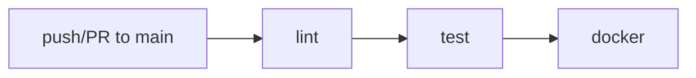
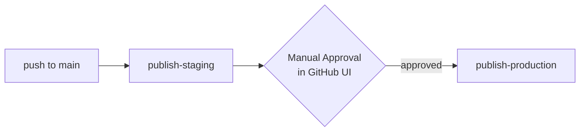

# CI/CD Pipeline — Simple Explanation

> Think of CI/CD as an **automatic factory** for your code. You push code, the factory checks it, builds it, and ships it — without you doing it by hand.

## 1. What is CI/CD?

| Term | Full Name | Simple Meaning |
|---|---|---|
| **CI** | Continuous Integration | Every time you push code, a robot checks it (lint + tests) |
| **CD** | Continuous Delivery | If checks pass, the robot builds a Docker box and ships it to storage (GHCR) |

**Analogy:** Like spell-check before sending an email. If spell-check fails, the email is not sent.

---

## 2. Your App in 10 Seconds

* **Code:** Python + Flask in `app.py:1` — 3 routes: `/` , `/health` , `/add/<a>/<b>`
* **Tests:** `tests/test_app.py:1` — 5 pytest tests check the routes work
* **Box:** `Dockerfile:1` — packs the app into a container so it runs anywhere
* **Factory:** GitHub Actions — 2 workflow files do the automation

---

## 3. Big Picture

```
You: git push  -->  GitHub  -->  CI checks code?  -->  CD ships image?
                     |                |                    |
                     |            [lint, test,           [staging ->
                     |             docker build]          production]
```

**Two separate factories:**

1.  `CI Pipeline` (`.github/workflows/ci.yml:1`) — runs on **every push/PR to `main`** — just **checks**, never ships
2.  `CD Pipeline` (`.github/workflows/cd.yml:1`) — runs **only on push to `main`** — **ships** the real image

---

## 4. CI Pipeline — The Checker (`.github/workflows/ci.yml:1`)

**When:** any `push` or `pull_request` to `main`

**3 jobs run in order:**



### Job 1: `lint` — Is the code clean?
1. `actions/checkout@v4` — download your code
2. `actions/setup-python@v5` — install Python 3.11
3. `pip install -r requirements.txt` — install dependencies
4. `ruff check .` — find style/bug errors
5. `ruff check --select ANN .` — check type hints exist
6. `ruff format --check .` — check code formatting

> If this fails → fix formatting/style, push again. No tests run yet.

### Job 2: `test` — Does the code work?
Same setup as above, then:
```bash
pytest -v   # runs 5 tests
```
> If this fails → `docker` job is **skipped**. Broken code never gets boxed.

### Job 3: `docker` — Can we box it and run it?
* `needs: [lint, test]` — only runs if both jobs above passed
1. `docker build -t ci-cd-pipeline-test:latest .` — build image from `Dockerfile:1`
2. `docker run -d -p 5000:5000 --name test-container ...` — start container
3. Retry loop `curl --fail http://localhost:5000/health` (15 attempts) — wait until app answers
4. `curl --fail http://localhost:5000/` — check main page
5. `docker stop` + `docker rm` — cleanup

> This proves the Dockerfile is not broken. `push: false` → image is **not** uploaded anywhere, just verified.

---

## 5. CD Pipeline — The Shipper (`.github/workflows/cd.yml:1`)

**When:** only `push` to `main` (not on PRs)

**Why separate from CI?** CI is for every idea (PR). CD only ships code that was **merged** to `main`.

**2 jobs run in order with a gate in between:**



### Job 1: `publish-staging` — Build once, test once

1. **Checkout + Buildx setup + Login to GHCR** (`ghcr.io` is GitHub's Docker storage)
2. **Build and push** (`docker/build-push-action@v5` with `push: true`):
   * Tags: `staging` + `sha-<short-commit>` (e.g., `sha-abc1234`)
   * Cache `type=gha` → faster next build
   * Saves `digest` (unique fingerprint like `sha256:abc...` — immutable ID of image)
3. **Smoke test staging:**
   ```bash
   docker pull ghcr.io/...:staging
   docker run -d -p 5000:5000 --name staging-test ...
   curl http://localhost:5000/health  # retry 15x
   curl http://localhost:5000/
   ```
   > If curl fails → pipeline fails, nothing goes to production.

### Job 2: `publish-production` — Promote without rebuilding

* `needs: publish-staging` — waits for staging to succeed
* `environment: production` — **pauses and waits for a human to click Approve** in GitHub (Settings > Environments > production > Required reviewers)
* `concurrency: group: production` — if you push twice fast, old waiting run is canceled

**3 steps inside:**

1.  **Guard against stale promotion** — checks: "Is the staging image I'm about to promote still the latest one in the registry?" If someone pushed a newer `staging` while you were waiting for approval, it **blocks** and says "approve the latest run instead". Prevents shipping old code.
2.  **Promote via `imagetools` (no rebuild):**
    ```bash
    docker buildx imagetools create --tag ghcr.io/...:latest  ghcr.io/...@sha256:<digest>
    docker buildx imagetools create --tag ghcr.io/...:stable ghcr.io/...@sha256:<digest>
    ```
    > No `docker build` again. Same bytes (`digest`) just get 2 new labels: `latest` + `stable`. Faster and safer.

3.  **Summary** — prints rollback command:
    ```bash
    docker buildx imagetools create --tag ghcr.io/...:latest ghcr.io/...@sha256:<old-digest>
    ```

> You can rollback by re-tagging an old digest — no rebuild needed.

---

## 6. Local vs CI vs CD

| Where | Command | What happens |
|---|---|---|
| **Your Laptop** | `pytest -v` / `docker build .` / `make up` | You test manually |
| **CI (GitHub, auto)** | push/PR → `ci.yml` | Robot runs lint + tests + docker build (no push) |
| **CD (GitHub, auto)** | push to `main` → `cd.yml` | Robot pushes to GHCR `:staging`, then after approval → `:latest` + `:stable` |

**Rule:** You can run the same steps locally before pushing to avoid waiting for GitHub:
```bash
pip install -r requirements.txt
ruff check . && ruff format --check .
pytest -v
docker build -t ci-cd-pipeline-test:latest .
docker run -d -p 5000:5000 --name ci-test ci-cd-pipeline-test:latest
curl http://localhost:5000/health
```

---

## 7. Real Example: Your Workflow

1.  Create branch: `git checkout -b feature/hello`
2.  Edit `app.py:12`, push, open PR → **CI runs** (lint→test→docker). If red ❌, fix.
3.  PR approved → merge to `main` → **CI runs again** + **CD starts**
4.  CD builds `:staging` and tests it ✅
5.  GitHub shows yellow **`Waiting for approval`** on `publish-production`
6.  You (or reviewer) click **Approve** → `:latest` and `:stable` appear in GHCR
7.  If bug found → rollback via digest command in summary

---

## 8. Key Files

```
.
├── app.py                         # Flask app
├── Dockerfile                     # How to build the container
├── docker-compose.yml             # Local/CD run config
├── requirements.txt               # Flask, pytest, gunicorn, ruff
├── Makefile                       # Shortcuts: make build, make up
├── .github/workflows/ci.yml       # Checker: lint → test → docker
├── .github/workflows/cd.yml       # Shipper: staging → (approval) → production
└── tests/test_app.py              # 5 tests
```

---

## 9. Quick Answers

* **Why not build twice in CD?** CD builds **once** for staging, then **re-tags** same digest for production → guarantees staging == production.
* **What is `digest`?** Permanent ID of image (`sha256:...`). Tag like `latest` can move, digest never changes.
* **What is GHCR?** GitHub Container Registry (`ghcr.io/isamir0/...`) — where Docker images are stored.
* **How to see it work?** `git push origin main` → go to https://github.com/isamir0/CI-CD-Pipeline-Test/actions
* **Badge in `README.md:3`?** Shows CI status: green = last main push passed, red = failed.

---

**In one sentence:** **CI** makes sure your code is correct, **CD** makes sure the exact same code can be shipped safely to users — with a human approval in the middle.
