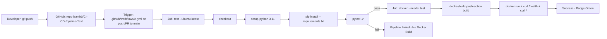

# CI/CD Pipeline — Full Cycle Documentation

This document describes the complete learning pipeline: from local development to CI (Continuous Integration) and CD (Continuous Delivery) with Python, Docker, and GitHub Actions.

## 1. Overview

**Goal:** Automatically test and build your Python app on every push, ensuring broken code never reaches `main` and a Docker image is always verifiable.

**Stack:**
- **App:** Python 3.11 + Flask (`app.py:1`)
- **Tests:** pytest (`tests/test_app.py:1`)
- **Container:** Docker (`Dockerfile:1`)
- **CI/CD:** GitHub Actions (`.github/workflows/ci.yml:1`)

## 2. Visual Cycle



**State Machine:**

| Stage | Status | Next |
|-------|--------|------|
| Push to `main` | Triggers CI | `test` job starts |
| `test` | ✅ pass | `docker` job runs |
| `test` | ❌ fail | Pipeline stops, no image build |
| `docker` | ✅ build + curl ok | Workflow ✅ |
| `docker` | ❌ build/curl fail | Workflow ❌ |

## 3. Local Development Cycle (Before Push)

This mirrors exactly what CI does, so you can debug locally.

### 3.1 Setup

```bash
python3 -m venv .venv
source .venv/bin/activate
pip install -r requirements.txt
```

### 3.2 Run App Locally

```bash
python app.py
# Visit http://localhost:5000/      -> {"message":"Hello, CI/CD Pipeline!"}
# Visit http://localhost:5000/health -> {"status":"ok"}
# Visit http://localhost:5000/add/4/6 -> {"a":4,"b":6,"result":10}
```

### 3.3 Run Tests Locally

```bash
pytest -v
# Expected: 5 passed in ~0.3s
# - test_home_status_code
# - test_home_message
# - test_health
# - test_add_unit
# - test_add_route
```

### 3.4 Docker Cycle

**Build:**

```bash
docker build -t ci-cd-pipeline-test:latest .
```

**Run:**

```bash
docker run -d -p 5000:5000 --name ci-test ci-cd-pipeline-test:latest
docker logs ci-test
curl http://localhost:5000/health
curl http://localhost:5000/
docker stop ci-test && docker rm ci-test
```

**What each Dockerfile instruction does (`Dockerfile:1`):**

```dockerfile
FROM python:3.11-slim          # Base image: minimal Debian + Python 3.11
ENV PYTHONUNBUFFERED=1         # Logs appear instantly (no buffering)
WORKDIR /app                   # Inside container, work in /app
COPY requirements.txt .       # Copy deps first -> layer caching (faster rebuilds)
RUN pip install -r requirements.txt  # Install Flask, pytest, gunicorn
COPY . .                       # Copy app.py, tests/
EXPOSE 5000                    # Document that app listens on 5000
CMD ["python", "app.py"]       # Default command when container starts
# Prod alternative: CMD ["gunicorn", "--bind", "0.0.0.0:5000", "app:app"]
```

**.dockerignore (`dockerignore:1`):** Prevents copying `.git`, `__pycache__`, `.venv` into image - keeps image small and cache clean.

## 4. CI/CD Pipeline Breakdown (`.github/workflows/ci.yml:1`)

**Name:** `CI Pipeline`

**Triggers (`on`):**
```yaml
on:
  push: { branches: [ "main" ] }
  pull_request: { branches: [ "main" ] }
```
Any push or PR to `main` triggers the workflow. This is CI: integrate often, test often.

**Job 1: `test` — Continuous Integration**

1. `actions/checkout@v4` — Clones repo into runner.
2. `actions/setup-python@v5` — Installs Python 3.11, enables pip cache.
3. `pip install -r requirements.txt` — Installs Flask + pytest.
4. `pytest -v` — Runs `tests/test_app.py:1`. If any test fails, job fails, `docker` never runs (due to `needs: test`).

**Job 2: `docker` — Continuous Delivery (Build Verification)**

- `needs: test` — Only runs if `test` passed (dependency).
- `docker/setup-buildx-action@v3` — Enables advanced Docker build features.
- `docker/build-push-action@v5` — Builds `Dockerfile:1` with `push: false` (no registry push for learning). Uses `type=gha` cache for speed.
- **Smoke test:**
  ```bash
  docker build -t ci-cd-pipeline-test:latest .
  docker run -d -p 5000:5000 --name test-container ci-cd-pipeline-test:latest
  sleep 5
  curl --fail http://localhost:5000/health
  curl --fail http://localhost:5000/
  docker stop test-container
  ```
  Ensures image actually *runs* and endpoints respond. If `curl` fails, logs are printed and job fails.

**Extending to Full CD (Optional Next Steps):**
- Add `push: true` + `docker/login-action` to push to Docker Hub/GHCR on `main` push.
- Add deployment job (e.g., SSH to server, `docker pull` + `docker run`, or deploy to Render/Fly.io).
- Add lint (`flake8`, `black --check`), coverage (`pytest --cov`).

## 5. How to Verify the Pipeline

1. **Push to GitHub:**
   ```bash
   git add .
   git commit -m "feat: add python app, docker, ci pipeline"
   git push origin main
   ```
2. **Check GitHub:** Go to `https://github.com/isamir0/CI-CD-Pipeline-Test/actions` — you should see “CI Pipeline” workflow running (yellow), then green ✅ if all passed.
3. **Badge:** `README.md:1` contains badge that reflects status:
   ``
4. **Simulate Failure (Learning):**
   - Edit `app.py:10` to return `{"message": "broken"}`.
   - Run `pytest -v` locally — observes failure.
   - Push — Actions shows red ❌, `docker` job skipped. This is CI protecting `main`.
   - Fix and push again — green.
5. **Pull Request Flow:**
   - Create branch `git checkout -b feature/x`, push, open PR to `main` — same pipeline runs on PR, blocking merge if red.

## 6. File Map

```
.
├── app.py                      # Flask app + add() utility
├── requirements.txt            # Flask, pytest, gunicorn
├── tests/
│   ├── __init__.py
│   └── test_app.py             # 5 pytest tests
├── Dockerfile                  # python:3.11-slim, build + run
├── .dockerignore               # Exclude git, pycache, venv
├── .github/workflows/ci.yml    # test -> docker jobs
├── PIPELINE.md                 # This file
└── README.md                   # Badge + quickstart
```

## 7. Troubleshooting

| Issue | Cause | Fix |
|-------|-------|-----|
| `pytest: command not found` | Not installed or venv not active | `pip install -r requirements.txt` |
| `docker: command not found` | Docker not installed | Install Docker Desktop (Win/Mac) or `docker.io` (Linux) |
| `curl: (7) Failed to connect` in CI | App not started yet | Already handled with `sleep 5`; increase to `10` if slow runner |
| Workflow not triggering | Pushed to non-`main` branch | Check `on.push.branches` or push to `main`/open PR |

## 8. Next Experiments for Learning

- [ ] Add `flake8` + `black` lint step before `pytest`.
- [ ] Add `pytest --cov` and upload coverage.
- [ ] Push image to GHCR: `ghcr.io/isamir0/ci-cd-pipeline-test:latest`.
- [ ] Deploy to free tier (Render, Fly.io) with CD job.
- [ ] Change base image to `python:3.12-alpine` and compare size (`docker images`).

---

**You now have a minimal but complete CI/CD loop to experiment with.**
