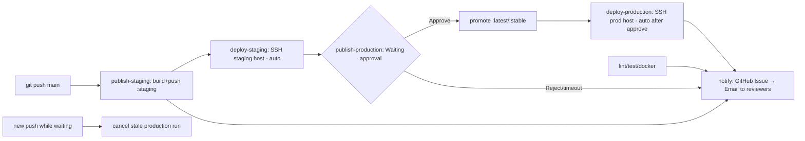

# CD Setup Steps — Staging Auto-Deploy + Production Approval + GitHub Email Notifications

This guide wires up `.github/workflows/cd.yml:1` (5 jobs) and `.github/workflows/ci.yml:1` (4 jobs) so that **every push to `main` auto-builds & deploys to staging**, **waits for manual approval before promoting/deploying to production**, and **sends GitHub Email (via assigned Issue) to production reviewers on failure (issue+cause) and success (ack)**. Two separate VPS/VMs (SSH) + `concurrency: cancel stale` are used. **No SMTP/Gmail App Password needed** — GitHub sends email to reviewers' registered GitHub email when they are assigned/@mentioned.

> Current `cd.yml` implements full flow: `publish-staging` `.github/workflows/cd.yml:11` builds `ghcr.io/...:staging` + `sha-*` and smoke-tests `.github/workflows/cd.yml:68`, `deploy-staging` `.github/workflows/cd.yml:96` auto-deploys to staging VPS via SSH (if `STAGING_HOST` set), `publish-production` `.github/workflows/cd.yml:140` waits on `environment: production` before promoting same digest to `:latest`/`:stable` via `imagetools` with stale guard `.github/workflows/cd.yml:183`, `deploy-production` `.github/workflows/cd.yml:245` auto-deploys to prod VPS after approval (if `PROD_HOST` set), `notify` `.github/workflows/cd.yml:290` creates **GitHub Issue assigned to reviewers** (triggers **GitHub Email**). `ci.yml` has `lint` `.github/workflows/ci.yml:10` → `test` `.github/workflows/ci.yml:36` → `docker` `.github/workflows/ci.yml:57` → `notify` `.github/workflows/ci.yml:88` with same GitHub Issue email. All successes notify (you chose **All successes**).
> GHCR-only mode still works: if `STAGING_HOST`/`PROD_HOST` secrets are empty, SSH jobs are skipped and pipeline remains green with registry tags only. GitHub Email needs no SMTP secrets — just `issues: write` and production reviewers; if no reviewers, fallback to repo owner.



---

## 0. Prerequisites

- Repo: `ibrahim-samir-makkook-ai/CI-CD-Pipeline` on branch `main`
- 2 Linux hosts (Ubuntu 22.04+): **staging** + **production** — reachable via SSH (port 22 or custom)
- Each host: `docker` + `docker compose` installed, SSH key access
- GitHub repo **admin** to create `Environments` + `Secrets` + `Variables`
- GitHub account for each production reviewer (email notifications enabled: `Settings → Notifications → Email` + repo `Watch → Custom → Issues`)
- `gh` CLI optional for local checks

---

## 1. Prepare Staging & Production Hosts

Run on **both** hosts (`STAGING_HOST` and `PROD_HOST` separately):

```bash
# 1.1 Install Docker (Ubuntu)
sudo apt-get update && sudo apt-get install -y ca-certificates curl gnupg
sudo install -m 0755 -d /etc/apt/keyrings
curl -fsSL https://download.docker.com/linux/ubuntu/gpg | sudo gpg --dearmor -o /etc/apt/keyrings/docker.gpg
echo "deb [arch=$(dpkg --print-architecture) signed-by=/etc/apt/keyrings/docker.gpg] https://download.docker.com/linux/ubuntu $(. /etc/os-release && echo $VERSION_CODENAME) stable" | sudo tee /etc/apt/sources.list.d/docker.list
sudo apt-get update && sudo apt-get install -y docker-ce docker-ce-cli containerd.io docker-buildx-plugin docker-compose-plugin
sudo usermod -aG docker $USER  # re-login after

# 1.2 Verify
docker --version && docker compose version

# 1.3 Prepare app directory
sudo mkdir -p /opt/ci-cd-pipeline && sudo chown $USER:$USER /opt/ci-cd-pipeline
cd /opt/ci-cd-pipeline

# 1.4 Create compose file — now templated via TAG (docker-compose.yml:6)
# Single file works on both hosts, just set TAG env:
cat > docker-compose.yml <<'YAML'
services:
  app:
    image: ghcr.io/isamir0/ci-cd-pipeline-test:${TAG:-staging}
    ports: ["5000:5000"]
    container_name: ci-cd-pipeline-test
    restart: unless-stopped
    healthcheck:
      test: ["CMD", "python", "-c", "import urllib.request; urllib.request.urlopen('http://localhost:5000/health')"]
      interval: 10s
      timeout: 3s
      retries: 3
      start_period: 5s
YAML
# Staging host uses: TAG=staging docker compose up -d
# Prod host uses:    TAG=stable  docker compose up -d

# 1.5 Open firewall if needed
sudo ufw allow 22/tcp
sudo ufw allow 5000/tcp  # or behind reverse proxy :80/443

# 1.6 Test manual pull (needs GHCR_PAT from Step 2)
echo "$GHCR_PAT" | docker login ghcr.io -u YOUR_GITHUB_USERNAME --password-stdin
TAG=staging docker compose pull && TAG=staging docker compose up -d
curl --fail http://localhost:5000/health && curl --fail http://localhost:5000/
docker compose logs --tail 50
```

> Note `Dockerfile:1` uses `gunicorn --bind 0.0.0.0:5000 app:app` and `HEALTHCHECK` — no extra config needed. `docker-compose.yml:6` now uses `${TAG:-staging}` (verified `TAG=stable docker compose config` → `:stable`).

---

## 2. Create GHCR PAT (for hosts to pull private images)

`GITHUB_TOKEN` `.github/workflows/cd.yml:36` is short-lived and **not reusable** from remote hosts. Create a persistent PAT:

1. GitHub → Settings → Developer settings → Personal access tokens → Tokens (classic)
2. Generate new token → Scopes: `read:packages`, `repo` (if private)
3. Expiry: 90d or custom → Copy token as `GHCR_PAT`
4. (Fine-grained alternative: Resource owner = your org, Repository access = this repo, Permissions → Packages: Read)

Test locally:
```bash
echo "$GHCR_PAT" | docker login ghcr.io -u ibrahim-samir-makkook-ai --password-stdin
docker pull ghcr.io/isamir0/ci-cd-pipeline-test:staging  # lowercased
```

---

## 3. SSH Key Setup

Use **dedicated deploy key** (don't reuse personal key).

```bash
# On your laptop (not on server)
ssh-keygen -t ed25519 -C "ci-cd-staging-deploy" -f ~/.ssh/ci_cd_staging -N ""
ssh-keygen -t ed25519 -C "ci-cd-prod-deploy" -f ~/.ssh/ci_cd_prod -N ""
# Or single key for both: ssh-keygen -t ed25519 -C "ci-cd-deploy" -f ~/.ssh/ci_cd_deploy

# Copy public key to each host
ssh-copy-id -i ~/.ssh/ci_cd_staging.pub USER@STAGING_HOST
ssh-copy-id -i ~/.ssh/ci_cd_prod.pub USER@PROD_HOST

# Verify non-interactive login
ssh -i ~/.ssh/ci_cd_staging USER@STAGING_HOST "docker ps"
```

Private keys (`~/.ssh/ci_cd_staging`, `~/.ssh/ci_cd_prod`) → paste into GitHub Secrets in Step 4. **Never commit keys.**

---

## 4. Configure GitHub Environments & Secrets

### 4.1 Create Environments

GitHub repo → **Settings → Environments → New environment**:

- **staging**:
  - No protection (auto-deploy)
  - URL: `http://STAGING_HOST:5000` (or your domain)
  - Optionally: Deployment branches → `Selected branches: main`
- **production**:
  - Check **Required reviewers** → add 1+ user/team (this creates the approval gate `.github/workflows/cd.yml:140`)
  - Check **Wait timer** → `0` min (optional)
  - URL: `http://PROD_HOST:5000`
  - Deployment branches → `main`

### 4.2 Add Repository Secrets

Settings → Secrets and variables → Actions → **New repository secret**:

| Secret | Value | Used by |
|---|---|---|
| `GHCR_PAT` | PAT from Step 2 | SSH deploy `docker login` |
| `STAGING_HOST` | `203.0.113.10` | `deploy-staging` `.github/workflows/cd.yml:96` (`if: STAGING_HOST` skip if empty) |
| `STAGING_USER` | `ubuntu` / `deploy` | SSH user |
| `STAGING_SSH_KEY` | contents of `~/.ssh/ci_cd_staging` (private PEM) | `appleboy/ssh-action` |
| `STAGING_SSH_PORT` | `22` (omit if default) | SSH |
| `STAGING_PATH` | `/opt/ci-cd-pipeline` | remote `cd` |
| `PROD_HOST` | `203.0.113.20` | `deploy-production` `.github/workflows/cd.yml:245` (`if: PROD_HOST`) |
| `PROD_USER` | `ubuntu` / `deploy` | — |
| `PROD_SSH_KEY` | contents of `~/.ssh/ci_cd_prod` | — |
| `PROD_SSH_PORT` | `22` | — |
| `PROD_PATH` | `/opt/ci-cd-pipeline` | — |
> Environment secrets alternative: put `STAGING_*` under `staging` environment, `PROD_*` under `production` environment for isolation.

### 4.3 GitHub Email Notifications — No Extra Secrets (optional migration note)

**GitHub Email needs no SMTP secrets.** `notify` jobs use `GITHUB_TOKEN` (auto) + `permissions: issues: write` to create assigned Issues; GitHub emails reviewers at their registered GitHub email.

<details><summary>Previously Gmail SMTP (now removed) — keep if you still use external SMTP</summary>

| Old Secret | Alternative Now |
|---|---|
| `GMAIL_USER` / `SMTP_USER` / `EMAIL_USER` | Not needed — GitHub login used |
| `GMAIL_APP_PASSWORD` / `SMTP_PASSWORD` / `EMAIL_PASSWORD` / `SMTP_HOST` / `SMTP_PORT` / `MAIL_FROM` | Not needed |
| `MAIL_TO_FALLBACK` / `REVIEWER_EMAIL_MAP` | Not needed — reviewers from `environment: production` + fallback to repo owner |

If you still want SMTP, keep `dawidd6/action-send-mail@v3` with `SMTP_*`; GitHub Email is default now.
</details>

### 4.4 Verify secrets not logged

Jobs mask secrets. Never `echo ${{ secrets.* }}` without masking. Deploy pipes `GHCR_PAT` via stdin; GitHub Email uses `GITHUB_TOKEN` (auto, masked).

---

## 5. How Workflows Work Today

### 5.1 `cd.yml` (5 jobs)

| Job | File | Trigger | What it does |
|---|---|---|---|
| `publish-staging` | `.github/workflows/cd.yml:11` | `push: main` `.github/workflows/cd.yml:4` | `docker/build-push-action@v5` pushes `:staging`+`sha-short`, caches `type=gha`, smoke-tests locally `.github/workflows/cd.yml:68` |
| `deploy-staging` | `.github/workflows/cd.yml:96` | `needs: publish-staging` + `if: STAGING_HOST` + `environment: staging` | SSH to `STAGING_HOST` (separate VPS) → `docker login ghcr.io` + `TAG=staging docker compose pull/up` + `curl /health` (auto). Skipped if `STAGING_HOST` empty → GHCR-only |
| `publish-production` | `.github/workflows/cd.yml:140` | `needs: publish-staging` + `environment: production` + `concurrency: production/cancel:true` | **Approval gate** — pauses `Waiting for approval` → stale guard `.github/workflows/cd.yml:183` → `imagetools create --tag :latest/:stable @digest` (no rebuild) |
| `deploy-production` | `.github/workflows/cd.yml:245` | `needs: publish-production` + `if: PROD_HOST` | SSH to `PROD_HOST` → `TAG=stable docker compose pull/up` + healthcheck. Auto after approval, **no second approval** (no protected env). Skipped if `PROD_HOST` empty |
| `notify` | `.github/workflows/cd.yml:290` | `needs: [publish-staging, deploy-staging, publish-production, deploy-production]` `if: always()` `permissions: issues: write` | **GitHub Issue (email)** to reviewers: failure → `❌` Issue+cause assigned + `@mention`, success → `✅` ack Issue auto-closed. Uses `actions/github-script@v7` to resolve `production` reviewers → `github.rest.issues.create`. No SMTP |

### 5.2 `ci.yml` (4 jobs)

| Job | File | Trigger | What it does |
|---|---|---|---|
| `lint` | `.github/workflows/ci.yml:10` | `push/PR to main` `.github/workflows/ci.yml:4` | `ruff check .` + `ruff check --select ANN` + `ruff format --check` |
| `test` | `.github/workflows/ci.yml:36` | same | `pytest -v` 5 tests |
| `docker` | `.github/workflows/ci.yml:57` | `needs: [lint, test]` | `docker build` + `curl /health` smoke |
| `notify` | `.github/workflows/ci.yml:88` | `needs: [lint, test, docker]` `if: always()` `permissions: issues: write` | **GitHub Issue (email)** to same reviewers: `lint` fail → `ruff`, `test` → `pytest`, `docker` → `curl /health`. Success → `✅` ack auto-closed |

Key guarantees:
- **Build once**: `latest`/`stable` are same bytes as `staging` (`digest` `.github/workflows/cd.yml:23`)
- **No stale prod**: `concurrency:group:production/cancel:true` + explicit stale check block old runs
- **Separate hosts**: `STAGING_HOST` vs `PROD_HOST` + `STAGING_PATH` vs `PROD_PATH` isolates envs; `docker-compose.yml:6` uses `image: ...:${TAG:-staging}`
- **Rollback**: use digest from summary: `docker buildx imagetools create --tag ghcr.io/...:latest ghcr.io/...@sha256:<digest>`
- **GHCR-only fallback**: leave `STAGING_HOST`/`PROD_HOST` empty → SSH jobs skipped
- **GitHub Email fallback**: if `production` has no reviewers, fallback to repo owner; cancelled stale `⚠️` not `❌`, no spam

---

## 6. `cd.yml` Deploy & Notify Jobs — Already Implemented (reference)

> **Status: Done** — `cd.yml` already contains `deploy-staging` `.github/workflows/cd.yml:96`, `deploy-production` `.github/workflows/cd.yml:245` (`appleboy/ssh-action@v1`, `concurrency: cancel stale`, `if: secrets.*_HOST != ''`), and `notify` `.github/workflows/cd.yml:290` (`actions/github-script@v7` → `github.rest.issues.create` → GitHub Email). Same pattern in `ci.yml:88` (`permissions: issues: write`). No SMTP.

Reference `deploy-staging` (auto, no approval):
```yaml
  deploy-staging:
    runs-on: ubuntu-latest
    needs: publish-staging
    if: ${{ secrets.STAGING_HOST != '' }}
    concurrency:
      group: staging-deploy-${{ github.ref }}
      cancel-in-progress: true
    environment:
      name: staging
      url: http://${{ secrets.STAGING_HOST }}:5000
    steps:
      - uses: appleboy/ssh-action@v1.0.3
        with:
          host: ${{ secrets.STAGING_HOST }}
          username: ${{ secrets.STAGING_USER }}
          key: ${{ secrets.STAGING_SSH_KEY }}
          port: ${{ secrets.STAGING_SSH_PORT || 22 }}
          script: |
            set -e
            IMAGE=$(echo "ghcr.io/${{ github.repository }}:staging" | tr '[:upper:]' '[:lower:]')
            TOKEN="${{ secrets.GHCR_PAT }}"; [ -z "$TOKEN" ] && TOKEN="${{ secrets.GITHUB_TOKEN }}"
            echo "$TOKEN" | docker login ghcr.io -u "${{ github.actor }}" --password-stdin
            docker pull "$IMAGE"
            cd "${{ secrets.STAGING_PATH || '/opt/ci-cd-pipeline' }}"
            TAG=staging docker compose pull && TAG=staging docker compose up -d
            for i in $(seq 1 15); do curl --fail http://localhost:5000/health && break || sleep 2; done
```

Reference `notify` (GitHub Issue → Email, no SMTP):
```yaml
  notify:
    runs-on: ubuntu-latest
    needs: [publish-staging, deploy-staging, publish-production, deploy-production]
    if: always()
    permissions: { contents: read, issues: write }
    steps:
      - id: reviewers  # GET /repos/.../environments/production → logins
        uses: actions/github-script@v7
      - id: msg  # Python builds subject/body from toJson(needs), causes per failed job
        # publish-staging: build/smoke cd.yml:68
        # deploy-staging: SSH cd.yml:109
        # publish-production: stale guard cd.yml:183 / imagetools
        # deploy-production: SSH cd.yml:259
      - if: is_failure
        uses: actions/github-script@v7  # issues.create {assignees: logins, labels: ['cd-failure','notify']} → GitHub emails reviewers
      - if: is_success
        uses: actions/github-script@v7  # issues.create then issues.update state:closed → ack email, no spam
```

Optional strict mode — gate promotion on staging host health (currently `publish-production` uses `needs: publish-staging` only for GHCR-only fallback). To enforce staging SSH must succeed before promotion, change to:
```yaml
  publish-production:
    needs: [publish-staging, deploy-staging]
```

**Single vs double approval:** `publish-production` uses `environment: production` with `Required reviewers`; `deploy-production` has **no protected environment** (runs auto after approval). If you add `environment: production` to `deploy-production`, GitHub will ask twice.

---

## 7. Verify End-to-End

```bash
# 7.1 Push to main (triggers CD + CI)
git checkout main && git pull
echo "# test $(date)" >> README.md
git commit -am "chore: trigger CD staging" && git push origin main

# 7.2 Watch in GitHub
# Actions → CD Pipeline → run →
#   publish-staging ✅ (logs: "Staging pushed: ..." + digest)
#   deploy-staging ✅ (or skipped if GHCR-only)
#   publish-production ⏸  "Waiting for approval" (yellow)
#   notify ⏳ waiting for production (runs after approve/reject)

# 7.3 While waiting, push again to test cancel-stale
echo "# second $(date)" >> README.md
git commit -am "chore: trigger cancel stale" && git push origin main
# Previous waiting run → "Canceled" due to concurrency:production/cancel:true
# notify for cancelled run logs ⚠️ Cancelled, no ❌ email

# 7.4 Approve latest run
# Actions → latest run → Review deployments → production → Approve

# After approve:
#   Promote step: "Creating tag: ...:latest -> ...@sha256:..."
#   deploy-production pulls :stable and curl /health
#   notify → GitHub Issue [CD] ✅ Success assigned to reviewers → GitHub emails them (auto-closed)

# 7.5 Check hosts
ssh $STAGING_USER@$STAGING_HOST "docker ps --format 'table {{.Names}}\t{{.Image}}\t{{.Status}}'; curl -s http://localhost:5000/health"
ssh $PROD_USER@$PROD_HOST "docker ps --format 'table {{.Names}}\t{{.Image}}\t{{.Status}}'; curl -s http://localhost:5000/health"

# 7.6 Check GHCR tags
docker buildx imagetools inspect ghcr.io/isamir0/ci-cd-pipeline-test:staging | grep -i digest
docker buildx imagetools inspect ghcr.io/isamir0/ci-cd-pipeline-test:stable | grep -i digest

# 7.7 GitHub Email verify
# Actions → run → notify → logs: logins=..., Created issue #N
# Issues → #N (assigned to reviewers) → reviewers get GitHub email (check inbox/Spam, Watch → Issues ON)
# Success issues auto-closed after creation (ack) but email already sent

# 7.8 CI verify (all successes path)
git commit --allow-empty -m "chore: test CI notify" && git push origin main
# Actions → CI Pipeline → notify → [CI] ✅ Success Issue auto-closed, email to reviewers

# 7.9 Trigger failure to test issue+cause
# Lint fail: echo "import os" >> app.py && git commit -am "break lint" && git push  # → [CI] ❌ lint failed: ruff
# CD staging fail: edit app.py:16 to return 500, push → deploy-staging health fails → [CD] ❌ deploy-staging
```

---

## 8. Rollback

All images immutable via digest:

```bash
# List recent digests (from Actions summary or GHCR)
docker buildx imagetools inspect ghcr.io/isamir0/ci-cd-pipeline-test:staging --raw | jq
IMAGE=$(echo "ghcr.io/isamir0/ci-cd-pipeline-test" | tr '[:upper:]' '[:lower:]')
OLD=sha256:<previous-digest-from-summary>

# GHCR-only rollback (no SSH): re-tag old digest as latest/stable
docker buildx imagetools create --tag $IMAGE:latest $IMAGE@$OLD
docker buildx imagetools create --tag $IMAGE:stable $IMAGE@$OLD

# VPS rollback: pull old digest and restart
ssh $PROD_USER@$PROD_HOST <<EOS
  echo "\$GHCR_PAT" | docker login ghcr.io -u ibrahim-samir-makkook-ai --password-stdin
  docker pull $IMAGE@$OLD
  docker tag $IMAGE@$OLD $IMAGE:stable
  cd /opt/ci-cd-pipeline && TAG=stable docker compose up -d
  curl --fail http://localhost:5000/health
EOS
```

---

## 9. Troubleshooting

| Symptom | Cause | Fix |
|---|---|---|
| `publish-production` stuck yellow forever | No reviewer added | Settings → Environments → production → Required reviewers → add user |
| `deploy-staging` fails `Permission denied (publickey)` | Wrong `STAGING_SSH_KEY` | Re-run `ssh-copy-id`, test `ssh -i ~/.ssh/ci_cd_staging USER@HOST` |
| `docker pull ghcr.io/...:staging: not found` | Repo lowercasing missing | Ensure `tr '[:upper:]' '[:lower:]'` in scripts |
| `docker login failed` on host | `GHCR_PAT` expired | Regenerate PAT `read:packages` |
| `curl /health` fails after deploy | Port/firewall | `ssh HOST "docker compose logs --tail 100; docker ps -a; curl -v http://localhost:5000/health"` |
| Stale promotion blocked | Approved old run | Approve **latest** run (stale guard `cd.yml:183`) |
| `concurrency` cancels prod instantly | New push while waiting | Intentional; re-approve latest |
| `appleboy/ssh-action` hangs | Firewall blocks GH Actions IPs | Allow 22, add `timeout: 60s` |
| `No reviewers resolved` → fallback to owner | `production` has no Required reviewers | Add reviewers: Settings → Environments → production → Required reviewers |
| `Resource not accessible by integration` | `notify` missing `issues: write` | Ensure `permissions: issues: write` (present in both `notify` jobs) |
| Issue labels `cd-failure` not found | Repo has no label | Job auto-retries without labels; create via `gh label create cd-failure --color FF0000` |
| Success spam noisy (All successes) | You chose All successes | Filter: add `if: github.ref=='refs/heads/main'` on success issue step |
| `getEnvironment failed 404` | `production` env not created | Create env Settings → Environments → production |
| No email received but Issue created | Reviewer has Email notifications OFF or not Watching | Reviewer: `Settings → Notifications → Email` ON, repo `Watch → Custom → Issues` ON, check Spam |

---

## 10. GitHub Email Notifications (CI + CD) — Failure (issue+cause) & Success Ack

Failure sends **GitHub Issue (triggers GitHub email)** with issue+cause, success sends **ack Issue (auto-closed)** to **production reviewers** (GitHub logins → email via GitHub), for both `ci.yml` and `cd.yml` (you chose `All successes`). **No SMTP/Gmail secrets needed** — uses `GITHUB_TOKEN` + `issues: write` to create assigned Issues; GitHub emails assignees/mentioned users at their registered GitHub email if they have **Watch** and **Email notifications** enabled.

### 10.1 How GitHub Email Works (no SMTP)

* GitHub sends email automatically when a user is **assigned** to an Issue or **@mentioned** in Issue body, if that user has: `Settings → Notifications → Email` enabled and repo `Watch → Custom → Issues` or `All Activity`.
* `notify` jobs resolve reviewers via **API** `GET /repos/{owner}/{repo}/environments/production` → `protection_rules[].reviewers` (the same users in `environment: production` Required reviewers `.github/workflows/cd.yml:140`). Falls back to repo owner if none.
* Then creates a **GitHub Issue** assigned to those logins with labels `ci-failure`/`cd-failure` or `ci-success`/`cd-success` + `notify`. Assignees get email. Success issues are auto-closed after creation (ack) but email already delivered.

### 10.2 No Secrets Needed (vs Gmail)

| Secret/Variable | Before (Gmail) | Now (GitHub Email) |
|---|---|---|
| `GMAIL_USER` / `SMTP_USER` / `GMAIL_APP_PASSWORD` / `SMTP_PASSWORD` / `MAIL_FROM` / `SMTP_HOST` | Required | **Not needed — delete** |
| `MAIL_TO_FALLBACK` / `REVIEWER_EMAIL_MAP` | Required | **Not needed — uses GitHub logins directly** |
| `GITHUB_TOKEN` | Already present | Requires `permissions: issues: write` (added to `notify` jobs `.github/workflows/cd.yml:290` and `.github/workflows/ci.yml:88`) |

If you previously added Gmail secrets, you can keep them (ignored) or remove via `gh secret remove`.

### 10.3 How Notify Jobs Work Now

* `ci.yml:88` `notify` `needs: [lint, test, docker]` `if: always()` `permissions: issues: write`:
  * `actions/github-script@v7` resolves `production` reviewers → `logins`
  * Python builds `subject`/`body` from `toJson(needs)`:
    * `lint` fail → `ruff check/format (ci.yml:27)`
    * `test` fail → `pytest -v (ci.yml:54)`
    * `docker` fail → `curl /health (ci.yml:67)`
    * success → `✅ Success — CI passed` | cancelled → `⚠️ Cancelled`
  * `is_failure` → `github.rest.issues.create({title, body + CC @logins, assignees: logins, labels: ['ci-failure','notify']})` — triggers email
  * `is_success` → same with `labels: ['ci-success','notify']` then auto-close `issues.update({state:'closed'})` (email already sent)

* `cd.yml:290` `notify` `needs: [publish-staging, deploy-staging, publish-production, deploy-production]` `if: always()` `permissions: issues: write`:
  * Same resolver
  * Causes: `publish-staging` fail → build/smoke `cd.yml:68`, `deploy-staging` → SSH `cd.yml:109`, `publish-production` → stale guard `cd.yml:183`/imagetools, `deploy-production` → SSH `cd.yml:259`, `cancelled` stale → `⚠️` not `❌`, success → digest `needs.publish-staging.outputs.digest` + rollback cmd
  * Failure → `labels: ['cd-failure','notify']` assigned issue (email)
  * Success → `labels: ['cd-success','notify']` then auto-closed (ack email, no issue spam)

Labels are created on first run if repo has no `notify` labels; if creation fails without labels, job retries without labels.

### 10.4 Verify GitHub Email

```bash
# 1. No secrets needed — just ensure production reviewers set
gh api repos/${{ github.repository }}/environments/production --jq '.protection_rules'

# 2. Trigger CI success → expect CI success Issue + email
git commit --allow-empty -m "chore: test CI notify" && git push origin main
# Actions → CI Pipeline → notify → logs: logins=..., Created CI success issue #N
# Issues → #N closed with `ci-success` label, reviewers assigned → check GitHub email inbox

# 3. Trigger CI failure → expect failure Issue
echo "import os" >> app.py; git commit -am "break lint" && git push  # → [CI] ❌ Failure issue assigned, email sent

# 4. Trigger CD failure (staging health)
# edit app.py:16 to return 500, push → deploy-staging fails → [CD] ❌ issue with cause

# 5. Trigger CD success ack → fix, push, approve prod → [CD] ✅ Success issue auto-closed, email to reviewers
# Check reviewers' GitHub notification email (and Watch settings)
# Issues → filter label:notify → see history

# 6. Cancelled stale: push twice fast while publish-production waiting → ⚠️ Cancelled — logged, no email
```

### 10.5 Troubleshooting GitHub Email

| Symptom | Cause | Fix |
|---|---|---|
| No email received but Issue created | Reviewer has Email notifications disabled or not Watching repo | Reviewer: `Settings → Notifications → Email` ON, repo `Watch → Custom → Issues` ON, check Spam |
| `No reviewers resolved` → fallback to owner | `production` environment has no Required reviewers | Add reviewers: Settings → Environments → production → Required reviewers |
| `getEnvironment failed 404` | Env `production` not created | Create env first |
| Issue labels `cd-failure` not found | Repo has no label | Job auto-retries without labels; manually create `cd-failure`, `cd-success`, `ci-failure`, `ci-success`, `notify` via `gh label create` |
| `Resource not accessible by integration` | `notify` missing `issues: write` | Ensure job has `permissions: issues: write` (present in both workflows) |
| Success spam noisy | `All successes` chosen | Filter: add `if: github.ref=='refs/heads/main'` on success issue step, or disable success ack by removing that step |

## 11. Quick Checklist

- [ ] Hosts: `docker` + `docker compose` installed, `/opt/ci-cd-pipeline/docker-compose.yml` present (`${TAG:-staging}`)
- [ ] GHCR PAT `read:packages`, secrets `GHCR_PAT` set
- [ ] SSH keys `authorized_keys`, secrets `*_SSH_KEY` set
- [ ] Environments `staging` (auto) + `production` (Required reviewers = 1) created
- [ ] Secrets `*_HOST`, `*_USER`, `*_PATH` set
- [ ] **GitHub Email notify:** no SMTP secrets — just `production` reviewers + `permissions: issues: write` in `notify` jobs; ensure reviewers have `Watch → Issues` + `Email` ON
- [ ] Push to `main` → staging green → `publish-production` waits → Approve → prod green + `notify` creates `✅ Success` Issue (auto-closed) → **GitHub emails** reviewers
- [ ] Break `lint`/`test`/`docker` or staging deploy → `notify` creates `❌ Failure` Issue assigned + `@mention` → **GitHub emails** reviewers with issue+cause
- [ ] `docker compose config` with `TAG=staging` → `:staging`, `TAG=stable` → `:stable`

---

## References

- CD workflow: `.github/workflows/cd.yml:1`, staging `publish-staging` `.github/workflows/cd.yml:11`, `deploy-staging` `.github/workflows/cd.yml:96`, prod `publish-production` `.github/workflows/cd.yml:140`, `deploy-production` `.github/workflows/cd.yml:245`, `notify` `.github/workflows/cd.yml:290`
- CI workflow: `.github/workflows/ci.yml:1`, `lint` `.github/workflows/ci.yml:10`, `test` `.github/workflows/ci.yml:36`, `docker` `.github/workflows/ci.yml:57`, `notify` `.github/workflows/ci.yml:88`
- App: `app.py:16` (`/health`), `Dockerfile:20`, `docker-compose.yml:6` (`${TAG:-staging}`)
- CI docs: `PIPELINE.md:1`, `CI_CD_SIMPLE.md:1`, `README.md:1`
