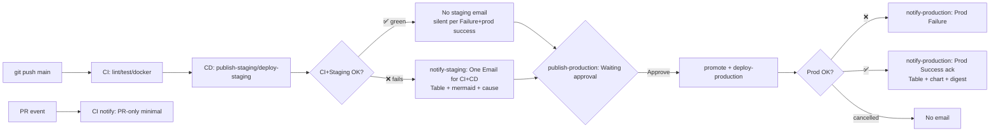

# CD Setup Steps — Staging Auto-Deploy + Production Approval + GitHub Email Notifications

This guide wires up `.github/workflows/cd.yml:1` (6 jobs) and `.github/workflows/ci.yml:1` (4 jobs) so that **every push to `main` auto-builds & deploys to staging**, **waits for manual approval before promoting/deploying to production**, and **sends one simple GitHub Email per phase (minimal with chart)** to production reviewers: **staging combined CI+CD email (failure only) + production email after approval (failure + success ack)**. Two separate VPS/VMs (SSH) + `concurrency: cancel stale` are used. **No SMTP/Gmail App Password needed** — GitHub sends email via assigned Issue.

> Current `cd.yml` implements full flow: `publish-staging` `.github/workflows/cd.yml:11` builds `ghcr.io/...:staging` + `sha-*` and smoke-tests `.github/workflows/cd.yml:68`, `deploy-staging` `.github/workflows/cd.yml:96` auto-deploys to staging VPS via SSH (if `STAGING_HOST` set), `publish-production` `.github/workflows/cd.yml:140` waits on `environment: production` before promoting same digest to `:latest`/`:stable` via `imagetools` with stale guard `.github/workflows/cd.yml:183`, `deploy-production` `.github/workflows/cd.yml:245` auto-deploys to prod VPS after approval (if `PROD_HOST` set), `notify-staging` `.github/workflows/cd.yml:290` **one email for CI+CD staging** (failure only, minimal table + mermaid, fetches CI `lint/test/docker` via API), `notify-production` `.github/workflows/cd.yml:426` **after approval** (failure + prod success ack, minimal chart). `ci.yml` has `lint` `.github/workflows/ci.yml:10` → `test` `.github/workflows/ci.yml:36` → `docker` `.github/workflows/ci.yml:57` → `notify` `.github/workflows/ci.yml:88` **PR-only** (push to `main` is covered by CD staging email to avoid duplicate). **Policy:** `Failure + prod success` — no staging-success spam.
> GHCR-only mode still works: if `STAGING_HOST`/`PROD_HOST` secrets are empty, SSH jobs are skipped and pipeline remains green with registry tags only. GitHub Email needs no SMTP secrets — just `issues: write` + `actions: read` (for CI fetch) and production reviewers; if no reviewers, fallback to repo owner.



---

## 0. Prerequisites

- Repo: `ibrahim-samir-makkook-ai/CI-CD-Pipeline` on branch `main`
- 2 Linux hosts (Ubuntu 22.04+): **staging** + **production** — reachable via SSH (port 22 or custom)
- Each host: `docker` + `docker compose` installed, SSH key access
- GitHub repo **admin** to create `Environments` + `Secrets` + `Variables`
- GitHub account for each production reviewer (email notifications enabled: `Settings → Notifications → Email` + repo `Watch → Custom → Issues`)
- `gh` CLI optional for local checks

---

## 1. Prepare Staging & Production Hosts

Run on **both** hosts (`STAGING_HOST` and `PROD_HOST` separately):

```bash
# 1.1 Install Docker (Ubuntu)
sudo apt-get update && sudo apt-get install -y ca-certificates curl gnupg
sudo install -m 0755 -d /etc/apt/keyrings
curl -fsSL https://download.docker.com/linux/ubuntu/gpg | sudo gpg --dearmor -o /etc/apt/keyrings/docker.gpg
echo "deb [arch=$(dpkg --print-architecture) signed-by=/etc/apt/keyrings/docker.gpg] https://download.docker.com/linux/ubuntu $(. /etc/os-release && echo $VERSION_CODENAME) stable" | sudo tee /etc/apt/sources.list.d/docker.list
sudo apt-get update && sudo apt-get install -y docker-ce docker-ce-cli containerd.io docker-buildx-plugin docker-compose-plugin
sudo usermod -aG docker $USER  # re-login after

# 1.2 Verify
docker --version && docker compose version

# 1.3 Prepare app directory
sudo mkdir -p /opt/ci-cd-pipeline && sudo chown $USER:$USER /opt/ci-cd-pipeline
cd /opt/ci-cd-pipeline

# 1.4 Create compose file — now templated via TAG (docker-compose.yml:6)
# Single file works on both hosts, just set TAG env:
cat > docker-compose.yml <<'YAML'
services:
  app:
    image: ghcr.io/isamir0/ci-cd-pipeline-test:${TAG:-staging}
    ports: ["5000:5000"]
    container_name: ci-cd-pipeline-test
    restart: unless-stopped
    healthcheck:
      test: ["CMD", "python", "-c", "import urllib.request; urllib.request.urlopen('http://localhost:5000/health')"]
      interval: 10s
      timeout: 3s
      retries: 3
      start_period: 5s
YAML
# Staging host uses: TAG=staging docker compose up -d
# Prod host uses:    TAG=stable  docker compose up -d

# 1.5 Open firewall if needed
sudo ufw allow 22/tcp
sudo ufw allow 5000/tcp  # or behind reverse proxy :80/443

# 1.6 Test manual pull (needs GHCR_PAT from Step 2)
echo "$GHCR_PAT" | docker login ghcr.io -u YOUR_GITHUB_USERNAME --password-stdin
TAG=staging docker compose pull && TAG=staging docker compose up -d
curl --fail http://localhost:5000/health && curl --fail http://localhost:5000/
docker compose logs --tail 50
```

> Note `Dockerfile:1` uses `gunicorn --bind 0.0.0.0:5000 app:app` and `HEALTHCHECK` — no extra config needed. `docker-compose.yml:6` now uses `${TAG:-staging}` (verified `TAG=stable docker compose config` → `:stable`).

---

## 2. Create GHCR PAT (for hosts to pull private images)

`GITHUB_TOKEN` `.github/workflows/cd.yml:36` is short-lived and **not reusable** from remote hosts. Create a persistent PAT:

1. GitHub → Settings → Developer settings → Personal access tokens → Tokens (classic)
2. Generate new token → Scopes: `read:packages`, `repo` (if private)
3. Expiry: 90d or custom → Copy token as `GHCR_PAT`
4. (Fine-grained alternative: Resource owner = your org, Repository access = this repo, Permissions → Packages: Read)

Test locally:
```bash
echo "$GHCR_PAT" | docker login ghcr.io -u ibrahim-samir-makkook-ai --password-stdin
docker pull ghcr.io/isamir0/ci-cd-pipeline-test:staging  # lowercased
```

---

## 3. SSH Key Setup

Use **dedicated deploy key** (don't reuse personal key).

```bash
# On your laptop (not on server)
ssh-keygen -t ed25519 -C "ci-cd-staging-deploy" -f ~/.ssh/ci_cd_staging -N ""
ssh-keygen -t ed25519 -C "ci-cd-prod-deploy" -f ~/.ssh/ci_cd_prod -N ""
# Or single key for both: ssh-keygen -t ed25519 -C "ci-cd-deploy" -f ~/.ssh/ci_cd_deploy

# Copy public key to each host
ssh-copy-id -i ~/.ssh/ci_cd_staging.pub USER@STAGING_HOST
ssh-copy-id -i ~/.ssh/ci_cd_prod.pub USER@PROD_HOST

# Verify non-interactive login
ssh -i ~/.ssh/ci_cd_staging USER@STAGING_HOST "docker ps"
```

Private keys (`~/.ssh/ci_cd_staging`, `~/.ssh/ci_cd_prod`) → paste into GitHub Secrets `STAGING_SSH_KEY`/`PROD_SSH_KEY` in Step 4. **Never commit keys.**

> **Password auth (your case `ibrahem@46.62.229.172`):** If server uses password (no key), skip key generation and instead add secret **`STAGING_PASSWORD`** = your `ibrahem` password for `46.62.229.172` (and `PROD_PASSWORD` if prod same/different). `cd.yml:113` `deploy-staging` now supports `password: ${{ secrets.STAGING_PASSWORD || secrets.STAGING_SSH_PASSWORD }}` as fallback to `key:` — leave `STAGING_SSH_KEY` empty when using password. Key is more secure for long term.

---

## 4. Configure GitHub Environments & Secrets

### 4.1 Create Environments

GitHub repo → **Settings → Environments → New environment**:

- **staging**:
  - No protection (auto-deploy)
  - URL: `http://STAGING_HOST:5000` (or your domain)
  - Optionally: Deployment branches → `Selected branches: main`
- **production**:
  - Check **Required reviewers** → add 1+ user/team (this creates the approval gate `.github/workflows/cd.yml:140`)
  - Check **Wait timer** → `0` min (optional)
  - URL: `http://PROD_HOST:5000`
  - Deployment branches → `main`

### 4.2 Add Repository Secrets

Settings → Secrets and variables → Actions → **New repository secret**:

| Secret | Value | Used by |
|---|---|---|
| `GHCR_PAT` | PAT from Step 2 | SSH deploy `docker login` |
| `STAGING_HOST` | `203.0.113.10` | `deploy-staging` `.github/workflows/cd.yml:96` (`if: STAGING_HOST` skip if empty) |
| `STAGING_USER` | `ubuntu` / `deploy` | SSH user |
| `STAGING_SSH_KEY` | contents of `~/.ssh/ci_cd_staging` (private PEM) | `appleboy/ssh-action` `key:` — leave empty if using password |
| `STAGING_PASSWORD` | password for `ibrahem@46.62.229.172` (your server) | `appleboy/ssh-action` `password:` — **you use this** (fallback `STAGING_SSH_PASSWORD`) |
| `STAGING_SSH_PORT` | `22` (omit if default) | SSH |
| `STAGING_PATH` | `/opt/ci-cd-pipeline` | remote `cd` |
| `PROD_HOST` | `203.0.113.20` | `deploy-production` `.github/workflows/cd.yml:245` (`if: PROD_HOST`) |
| `PROD_USER` | `ubuntu` / `deploy` | — |
| `PROD_SSH_KEY` | contents of `~/.ssh/ci_cd_prod` | — |
| `PROD_PASSWORD` | password for prod host (or reuse `STAGING_PASSWORD`) | `password:` fallback |
| `PROD_SSH_PORT` | `22` | — |
| `PROD_PATH` | `/opt/ci-cd-pipeline` | — |
> Environment secrets alternative: put `STAGING_*` under `staging` environment, `PROD_*` under `production` environment for isolation.

### 4.3 GitHub Email Notifications — No Extra Secrets (optional migration note)

**GitHub Email needs no SMTP secrets.** `notify` jobs use `GITHUB_TOKEN` (auto) + `permissions: issues: write` to create assigned Issues; GitHub emails reviewers at their registered GitHub email.

<details><summary>Previously Gmail SMTP (now removed) — keep if you still use external SMTP</summary>

| Old Secret | Alternative Now |
|---|---|
| `GMAIL_USER` / `SMTP_USER` / `EMAIL_USER` | Not needed — GitHub login used |
| `GMAIL_APP_PASSWORD` / `SMTP_PASSWORD` / `EMAIL_PASSWORD` / `SMTP_HOST` / `SMTP_PORT` / `MAIL_FROM` | Not needed |
| `MAIL_TO_FALLBACK` / `REVIEWER_EMAIL_MAP` | Not needed — reviewers from `environment: production` + fallback to repo owner |

If you still want SMTP, keep `dawidd6/action-send-mail@v3` with `SMTP_*`; GitHub Email is default now.
</details>

### 4.4 Verify secrets not logged

Jobs mask secrets. Never `echo ${{ secrets.* }}` without masking. Deploy pipes `GHCR_PAT` via stdin; GitHub Email uses `GITHUB_TOKEN` (auto, masked).

---

## 5. How Workflows Work Today

### 5.1 `cd.yml` (6 jobs — one email per phase)

| Job | File | Trigger | What it does |
|---|---|---|---|
| `publish-staging` | `.github/workflows/cd.yml:11` | `push: main` `.github/workflows/cd.yml:4` | `docker/build-push-action@v5` pushes `:staging`+`sha-short`, caches `type=gha`, smoke-tests locally `.github/workflows/cd.yml:68` |
| `deploy-staging` | `.github/workflows/cd.yml:96` | `needs: publish-staging` + `if: STAGING_HOST` + `environment: staging` | SSH to `STAGING_HOST` (separate VPS) → `docker login ghcr.io` + `TAG=staging docker compose pull/up` + `curl /health` (auto). Skipped if `STAGING_HOST` empty → GHCR-only |
| `publish-production` | `.github/workflows/cd.yml:140` | `needs: publish-staging` + `environment: production` + `concurrency: production/cancel:true` | **Approval gate** — pauses `Waiting for approval` → stale guard `.github/workflows/cd.yml:183` → `imagetools create --tag :latest/:stable @digest` (no rebuild) |
| `deploy-production` | `.github/workflows/cd.yml:245` | `needs: publish-production` + `if: PROD_HOST` | SSH to `PROD_HOST` → `TAG=stable docker compose pull/up` + healthcheck. Auto after approval, **no second approval** (no protected env). Skipped if `PROD_HOST` empty |
| `notify-staging` | `.github/workflows/cd.yml:290` | `needs: [publish-staging, deploy-staging]` `if: always()` `permissions: issues: write, actions: read` | **One email for CI+CD staging** (failure only, per `Failure + prod success`): fetches CI `lint/test/docker` via API `listWorkflowRuns(head_sha)` + `listJobsForWorkflowRun`, builds **minimal table + mermaid chart** (`lint→test→docker→staging_build→staging_deploy`), `labels: ['staging-failure','notify']` → GitHub email. Success → silent (`::notice`) |
| `notify-production` | `.github/workflows/cd.yml:426` | `needs: [publish-production, deploy-production]` `if: always()` `permissions: issues: write` | **After approval**: failure → `❌` Issue (`prod-failure`), success → `✅` ack auto-closed (`prod-success`), minimal table `promote/deploy` + mermaid `promote→deploy` + `digest`/`rollback`. **Failure + prod success** policy |

### 5.2 `ci.yml` (4 jobs — PR-only notify)

| Job | File | Trigger | What it does |
|---|---|---|---|
| `lint` | `.github/workflows/ci.yml:10` | `push/PR to main` `.github/workflows/ci.yml:4` | `ruff check .` + `ruff check --select ANN` + `ruff format --check` |
| `test` | `.github/workflows/ci.yml:36` | same | `pytest -v` 5 tests |
| `docker` | `.github/workflows/ci.yml:57` | `needs: [lint, test]` | `docker build` + `curl /health` smoke |
| `notify` | `.github/workflows/ci.yml:88` | `needs: [lint, test, docker]` `if: always() && github.event_name == 'pull_request'` `permissions: issues: write` | **PR-only minimal** (push to `main` covered by CD staging email to avoid duplicate): failure → `❌` Issue `ci-failure`, success silent for push. Minimal table + mermaid |

Key guarantees:
- **Build once**: `latest`/`stable` are same bytes as `staging` (`digest` `.github/workflows/cd.yml:23`)
- **No stale prod**: `concurrency:group:production/cancel:true` + explicit stale check block old runs
- **Separate hosts**: `STAGING_HOST` vs `PROD_HOST` + `STAGING_PATH` vs `PROD_PATH` isolates envs; `docker-compose.yml:6` uses `image: ...:${TAG:-staging}`
- **Rollback**: use digest from summary: `docker buildx imagetools create --tag ghcr.io/...:latest ghcr.io/...@sha256:<digest>`
- **GHCR-only fallback**: leave `STAGING_HOST`/`PROD_HOST` empty → SSH jobs skipped
- **GitHub Email fallback**: if `production` has no reviewers, fallback to repo owner; cancelled stale `⚠️` not `❌`, no spam

---

## 6. `cd.yml` Deploy & Notify Jobs — Already Implemented (reference)

> **Status: Done** — `cd.yml` now has `deploy-staging` `.github/workflows/cd.yml:96`, `deploy-production` `.github/workflows/cd.yml:245` (`appleboy/ssh-action@v1`, `concurrency: cancel stale`, `if: secrets.*_HOST != ''`), plus **one email per phase**: `notify-staging` `.github/workflows/cd.yml:290` (CI+CD staging, failure only) and `notify-production` `.github/workflows/cd.yml:426` (after approval, failure + success ack), both `permissions: issues: write` (+ `actions: read` for staging to fetch CI). `ci.yml:88` is **PR-only** to avoid duplicate on `main` push.

Reference `notify-staging` (one email for CI+CD, minimal visual):
```yaml
  notify-staging:
    runs-on: ubuntu-latest
    needs: [publish-staging, deploy-staging]  # plus CI fetched via API
    if: always()
    permissions: { contents: read, issues: write, actions: read }
    steps:
      - id: reviewers  # GET /environments/production → logins
      - id: ci  # listWorkflowRuns(workflow_id: 'ci.yml', head_sha) → lint/test/docker
      - id: msg  # Python builds minimal table + mermaid: lint→test→docker→staging_build→staging_deploy
      - if: is_failure  # labels: ['staging-failure','notify'] → GitHub email
      - if: is_success → silent (::notice) per Failure+prod success
```

Reference `notify-production` (after approval):
```yaml
  notify-production:
    runs-on: ubuntu-latest
    needs: [publish-production, deploy-production]
    if: always()
    permissions: { contents: read, issues: write }
    steps:
      - id: reviewers
      - id: msg  # table: promote/deploy + mermaid promote→deploy + digest/rollback
      - if: is_failure → labels ['prod-failure','notify']
      - if: is_success → labels ['prod-success','notify'] + auto-close
```

Optional strict mode — gate promotion on staging host health (currently `publish-production` uses `needs: publish-staging` only for GHCR-only fallback). To enforce staging SSH must succeed before promotion, change to:
```yaml
  publish-production:
    needs: [publish-staging, deploy-staging]
```

**Single vs double approval:** `publish-production` uses `environment: production` with `Required reviewers`; `deploy-production` has **no protected environment** (runs auto after approval). If you add `environment: production` to `deploy-production`, GitHub will ask twice.

---

## 7. Verify End-to-End (one email per phase, minimal)

```bash
# 7.1 Push to main (triggers CI + CD)
git checkout main && git pull
echo "# test $(date)" >> README.md
git commit -am "chore: trigger staging" && git push origin main

# 7.2 Watch in GitHub
# Actions → CD Pipeline → run →
#   publish-staging ✅ (logs: "Staging pushed: ..." + digest)
#   deploy-staging ✅ (or skipped if GHCR-only)
#   notify-staging ⏭️ silent if CI+Staging green (Failure+prod success) — no email
#   publish-production ⏸  "Waiting for approval" (yellow)

# 7.2b Staging failure → one email for CI+CD (minimal with chart)
# Break lint or test: echo "import os" >> app.py && git commit -am "break" && git push
# → notify-staging creates [Staging] ❌ Failure Issue with table:
#   | CI lint | ❌ failure | | CI test | ✅ | | Staging build | ✅ |
#   ```mermaid flowchart LR lint-->test-->docker-->staging```
#   Assigned to production reviewers → GitHub emails

# 7.3 While waiting for approval, push again to test cancel-stale
echo "# second $(date)" >> README.md
git commit -am "chore: trigger cancel stale" && git push origin main
# Previous waiting run → "Canceled" due to concurrency:production/cancel:true
# notify-staging/production for cancelled run logs ⚠️ Cancelled, no email

# 7.4 Approve latest run (production)
# Actions → latest run → Review deployments → production → Approve

# After approve:
#   Promote step: "Creating tag: ...:latest -> ...@sha256:..."
#   deploy-production pulls :stable and curl /health
#   notify-production → [Prod] ✅ Success Issue (auto-closed) with minimal table:
#     | Prod promote | ✅ | | Prod deploy | ✅ |
#     ```mermaid flowchart LR promote-->deploy```
#     Digest + rollback + CC @reviewers → GitHub emails reviewers

# 7.5 Check hosts & GHCR
ssh $STAGING_USER@$STAGING_HOST "docker ps --format 'table {{.Names}}\t{{.Image}}\t{{.Status}}'; curl -s http://localhost:5000/health"
docker buildx imagetools inspect ghcr.io/isamir0/ci-cd-pipeline-test:staging | grep -i digest

# 7.6 GitHub Email verify
# Actions → run → notify-staging / notify-production → logs: logins=..., Created issue #N
# Issues → #N (labels: staging-failure / prod-success, notify) → reviewers get GitHub email (Watch → Issues ON)

# 7.7 PR verify (PR-only CI email)
# Create PR: git checkout -b feature/x && git push -u origin feature/x && gh pr create --fill
# → CI Pipeline → notify (PR-only) → [CI] ❌ only on PR failure (minimal)

# 7.8 Prod failure test
# Break prod health: edit prod docker-compose to bad image, push, approve → [Prod] ❌ Failure issue with cause

# 7.9 Endpoints
curl https://STAGING_HOST:5000/health || curl http://STAGING_HOST:5000/health
curl https://PROD_HOST:5000/health
```

---

## 8. Rollback

All images immutable via digest:

```bash
# List recent digests (from Actions summary or GHCR)
docker buildx imagetools inspect ghcr.io/isamir0/ci-cd-pipeline-test:staging --raw | jq
IMAGE=$(echo "ghcr.io/isamir0/ci-cd-pipeline-test" | tr '[:upper:]' '[:lower:]')
OLD=sha256:<previous-digest-from-summary>

# GHCR-only rollback (no SSH): re-tag old digest as latest/stable
docker buildx imagetools create --tag $IMAGE:latest $IMAGE@$OLD
docker buildx imagetools create --tag $IMAGE:stable $IMAGE@$OLD

# VPS rollback: pull old digest and restart
ssh $PROD_USER@$PROD_HOST <<EOS
  echo "\$GHCR_PAT" | docker login ghcr.io -u ibrahim-samir-makkook-ai --password-stdin
  docker pull $IMAGE@$OLD
  docker tag $IMAGE@$OLD $IMAGE:stable
  cd /opt/ci-cd-pipeline && TAG=stable docker compose up -d
  curl --fail http://localhost:5000/health
EOS
```

---

## 9. Troubleshooting

| Symptom | Cause | Fix |
|---|---|---|
| `publish-production` stuck yellow forever | No reviewer added | Settings → Environments → production → Required reviewers → add user |
| `deploy-staging` fails `Permission denied (publickey)` | Wrong `STAGING_SSH_KEY` | Re-run `ssh-copy-id`, test `ssh -i ~/.ssh/ci_cd_staging USER@HOST` |
| `docker pull ghcr.io/...:staging: not found` | Repo lowercasing missing | Ensure `tr '[:upper:]' '[:lower:]'` in scripts |
| `docker login failed` on host | `GHCR_PAT` expired | Regenerate PAT `read:packages` |
| `curl /health` fails after deploy | Port/firewall | `ssh HOST "docker compose logs --tail 100; docker ps -a; curl -v http://localhost:5000/health"` |
| Stale promotion blocked | Approved old run | Approve **latest** run (stale guard `cd.yml:183`) |
| `concurrency` cancels prod instantly | New push while waiting | Intentional; re-approve latest |
| `appleboy/ssh-action` hangs | Firewall blocks GH Actions IPs | Allow 22, add `timeout: 60s` |
| `No reviewers resolved` → fallback to owner | `production` has no Required reviewers | Add reviewers: Settings → Environments → production → Required reviewers |
| `Resource not accessible by integration` | `notify` missing `issues: write` | Ensure `permissions: issues: write` (present in both `notify` jobs) |
| Issue labels `cd-failure` not found | Repo has no label | Job auto-retries without labels; create via `gh label create cd-failure --color FF0000` |
| Success spam noisy (All successes) | You chose All successes | Filter: add `if: github.ref=='refs/heads/main'` on success issue step |
| `getEnvironment failed 404` | `production` env not created | Create env Settings → Environments → production |
| No email received but Issue created | Reviewer has Email notifications OFF or not Watching | Reviewer: `Settings → Notifications → Email` ON, repo `Watch → Custom → Issues` ON, check Spam |

---

## 10. GitHub Email Notifications — One Simple Email for CI+CD (Minimal + Chart)

Policy: **Failure + prod success** — staging combined CI+CD email only on failure (silent on staging success); production email after approval on both failure and success ack. **One email for CI+CD staging** = CI `lint/test/docker` + CD `publish-staging/deploy-staging` in same Issue table + mermaid. GitHub Issue triggers email (no SMTP).

### 10.1 How GitHub Email Works (no SMTP)

* GitHub emails when user is **assigned** or **@mentioned** in Issue, if `Settings → Notifications → Email` ON + repo `Watch → Custom → Issues`.
* Jobs resolve reviewers via `GET /repos/{owner}/{repo}/environments/production` → `protection_rules[].reviewers` (same as `environment: production` gate `.github/workflows/cd.yml:140`), fallback to repo owner.
* Creates Issue with labels `staging-failure` / `prod-failure` / `prod-success` / `ci-failure` + `notify` + `CC @logins` in body. Success issues auto-closed after creation (email already sent).

### 10.2 No Secrets Needed

| Secret | Before (Gmail SMTP) | Now (GitHub Email) |
|---|---|---|
| `GMAIL_USER`/`SMTP_*`/`MAIL_FROM` | Required | **Not needed — delete** |
| `MAIL_TO_FALLBACK`/`REVIEWER_EMAIL_MAP` | Required | **Not needed — uses GitHub logins** |
| `GITHUB_TOKEN` | Already present | Requires `permissions: issues: write` (+ `actions: read` for staging to fetch CI) — present in `notify-staging` `.github/workflows/cd.yml:290` / `notify-production` `.github/workflows/cd.yml:426` / PR `notify` `.github/workflows/ci.yml:88` |

### 10.3 How Notify Jobs Work Now (minimal visual)

* **`ci.yml:88` PR-only** `needs: [lint, test, docker]` `if: always() && github.event_name == 'pull_request'` `permissions: issues: write`:
  * Resolves reviewers → builds **minimal** `| Stage | Status |` table (3 rows) + ````mermaid flowchart LR lint-->test-->docker```` → `is_failure` → `labels: ['ci-failure','notify']` (PR failure only). Push to `main` silent — covered by CD staging.
  * Subject `[CI] ❌ Failure sha — lint,test` (failure) — no verbose JSON.

* **`cd.yml:290` `notify-staging`** `needs: [publish-staging, deploy-staging]` `if: always()` `permissions: issues: write, actions: read`:
  * Steps: `resolve reviewers` → `fetch CI status` (`listWorkflowRuns(workflow_id: 'ci.yml', per_page:10)` filtered by `head_sha` → `listJobsForWorkflowRun` → `lint/test/docker` conclusions) → `build minimal` Python:
    * Table 5 rows: `CI lint | ✅/❌ | CI test | ... | Staging build/deploy`
    * Mermaid `flowchart LR lint-->test-->docker-->staging_build-->staging_deploy` with fail highlights
    * Causes: 1 line per failed job (`lint: ruff`, `test: pytest`, `staging build: smoke`, `staging deploy: SSH`)
  * `is_failure` → `labels: ['staging-failure','notify']` → GitHub email | `is_success` → silent `::notice` (per `Failure + prod success`).

* **`cd.yml:426` `notify-production`** `needs: [publish-production, deploy-production]` `if: always()`:
  * Minimal table 2 rows `Prod promote | ✅ | Prod deploy | ✅` + `mermaid flowchart LR promote-->deploy` + `digest` (if available) + `rollback` on success
  * `is_failure` → `labels: ['prod-failure','notify']` | `is_success` → `labels: ['prod-success','notify']` auto-closed | `is_cancelled` → no email.

All bodies ~15 lines vs previous ~30, no `Results: JSON` dump, no `Reviewers (GitHub):` block — just table + chart + cause + link.

### 10.4 Verify GitHub Email (one email per phase)

```bash
# 1. No secrets — ensure reviewers set
gh api repos/OWNER/REPO/environments/production --jq '.protection_rules[].reviewers'

# 2. Staging failure (one email for CI+CD) → expect [Staging] ❌
echo "import os" >> app.py; git commit -am "break lint" && git push origin main
# Actions → notify-staging → logs: CI lint ❌ + staging, Created issue #N with table + mermaid, assigned → email
# Staging success → notify-staging logs "Staging passed — no email (silent)" — no Issue

# 3. Production success ack → push green, approve prod
git commit --allow-empty -m "fix" && git push origin main
# approve in Actions → notify-production → [Prod] ✅ Success Issue auto-closed + digest → email

# 4. PR: git checkout -b feature/x && gh pr create → CI notify PR-only → [CI] ❌ only on PR failure

# 5. Cancelled stale: push twice fast → ⚠️ Cancelled — logged, no email
# Issues → filter label:notify → 1 prod success Issue per main push (not 2)
```

### 10.5 Troubleshooting GitHub Email

| Symptom | Cause | Fix |
|---|---|---|
| No email but Issue created | Watch/Email OFF | Reviewer: `Settings → Notifications → Email` ON, repo `Watch → Custom → Issues` ON, check Spam |
| `No reviewers` → owner fallback | No Required reviewers | Add reviewers to `production` env |
| `getEnvironment 404` | Env missing | Create `production` env |
| Labels missing | Repo has no label | Job retries without labels; `gh label create staging-failure --color FF0000` |
| `Resource not accessible` | Missing `issues: write` / `actions: read` | Check job permissions (present) |
| CI status `skipped` in staging table | CI not found for sha yet (race) | Staging fetch retries; check `GITHUB_RUN_ID`/`head_sha` mismatch; re-run workflow |
| Want staging success email too | Current `Failure + prod success` silences it | Change `notify-staging` second step to also handle `is_success` → create `staging-success` auto-closed |

## 11. Quick Checklist (one email per phase)

- [ ] Hosts: `docker` + `docker compose` installed, `/opt/ci-cd-pipeline/docker-compose.yml` present (`${TAG:-staging}`)
- [ ] GHCR PAT `read:packages`, secrets `GHCR_PAT` set
- [ ] SSH keys `authorized_keys`, secrets `*_SSH_KEY` set
- [ ] Environments `staging` (auto) + `production` (Required reviewers = 1) created
- [ ] Secrets `*_HOST`, `*_USER`, `*_PATH` set
- [ ] **GitHub Email notify:** `permissions: issues: write` (+ `actions: read` for staging) in `notify-staging` `.github/workflows/cd.yml:290` / `notify-production` `.github/workflows/cd.yml:426` / PR `notify` `.github/workflows/ci.yml:88`; reviewers `Watch → Issues` + `Email` ON; labels `staging-failure`/`prod-success` exist (or auto-created)
- [ ] Push to `main` green → **no staging email** (silent) → Approve → `notify-production` → `✅ Success` auto-closed Issue with minimal table + mermaid + digest → **one prod email**
- [ ] Break CI `lint` or staging `deploy-staging` → `notify-staging` → **one `[Staging] ❌` Issue** (CI+CD table + chart + cause) → **email**; prod not reached
- [ ] Break `publish-production`/`deploy-production` → `notify-production` → `[Prod] ❌` Issue → email
- [ ] `docker compose config` with `TAG=staging` → `:staging`, `TAG=stable` → `:stable`

---

## References

- CD workflow: `.github/workflows/cd.yml:1`, staging `publish-staging` `.github/workflows/cd.yml:11`, `deploy-staging` `.github/workflows/cd.yml:96`, prod `publish-production` `.github/workflows/cd.yml:140`, `deploy-production` `.github/workflows/cd.yml:245`, `notify-staging` `.github/workflows/cd.yml:290` (one email for CI+CD, failure only), `notify-production` `.github/workflows/cd.yml:426` (after approval, failure + success)
- CI workflow: `.github/workflows/ci.yml:1`, `lint` `.github/workflows/ci.yml:10`, `test` `.github/workflows/ci.yml:36`, `docker` `.github/workflows/ci.yml:57`, `notify` `.github/workflows/ci.yml:88` (PR-only, push to main covered by CD staging)
- App: `app.py:16` (`/health`), `Dockerfile:20`, `docker-compose.yml:6` (`${TAG:-staging}`)
- CI docs: `PIPELINE.md:1`, `CI_CD_SIMPLE.md:1`, `README.md:1`
